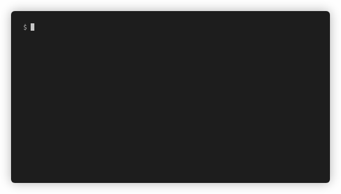

# gitget [](https://goreportcard.com/report/github.com/FalcoSuessgott/gitget)

<p align="center">
  
</p>
Browse interactively through branches, files and directories of a git repository and download them into your current working directory.

# Features
* browse and checkout available branches
* recursively copy directories
* reading clipboard buffer for avaiable git-urls
* https- and ssh-cloning

# Installation
```sh
go get github.com/FalcoSuessgott/gitget
```

# Supported OS
* Windows
* MacOS
* Linux

# Usage
```
NAME:
   gitget - Browse interactively through branches, files and directories of a git repository and download them

USAGE:
   gitget GIT_URL (e.g gitget https://github.com/golang/example)

VERSION:
   1.1.0

COMMANDS:
   help, h  Shows a list of commands or help for one command

GLOBAL OPTIONS:
   --help, -h     show help (default: false)
   --version, -v  print the version (default: false)
```

