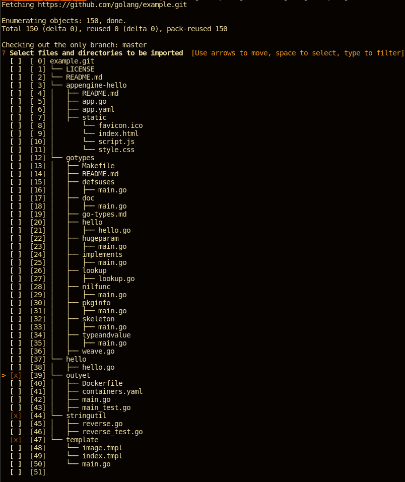
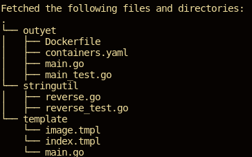

# gitget
Browse through files and directories of git repository and download them

# Installation
```sh
go get github.com/FalcoSuessgott/gitget
```

# Usage
```
$ gitget https://github.com/golang/example
```

# Screenshots


