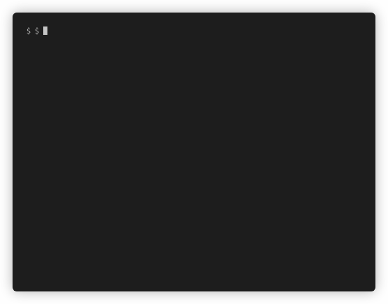

# gitget
Browse interactively through files and directories of git repositories and download them ntto your current working directory (`$PWD`).

# Supported OS
* Windows
* MacOS
* Linux

# Installation
```sh
go get github.com/FalcoSuessgott/gitget
```

# Usage
```
$ gitget https://github.com/golang/example
```

# Features
* checkout branches
* recursively copiying directories
* read git-urls from Clipboard Buffer
* https- and ssh-cloning

# Demo

